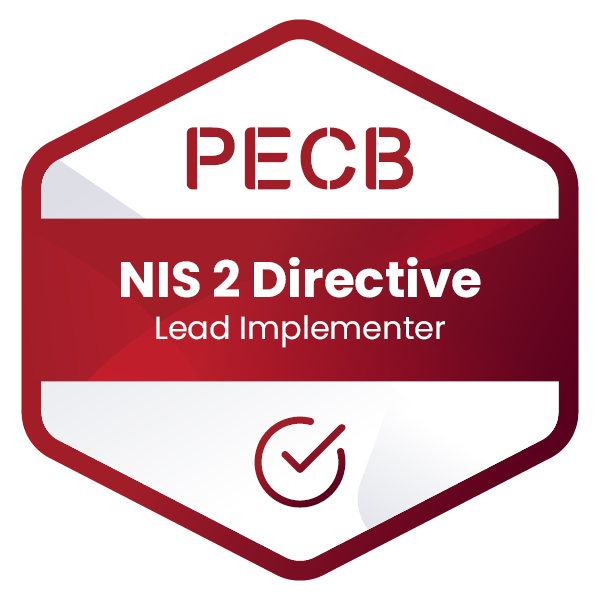

# Martijn

Software engineer building secure, self-hosted applications with a focus on zero-knowledge architecture and privacy-first design.

I work across the full stack but lean toward infrastructure, security, and product engineering.

### Certifications

---

## Current

Building products under **[DoDyna](https://dodyna.com)** — an umbrella for zero-knowledge tools and SaaS projects.

### Flagship

No accounts. No logs. No trust required.

### Domains in Incubation

| Domain                                                                                                               | Focus                    |
| :------------------------------------------------------------------------------------------------------------------- | :----------------------- |
|         | Security tooling         |
|  | Vulnerability management |
|    | Connection logging       |
|                   | Short links              |

---

## Background

Started as a student developer at **PIA Service**, where I built and maintained multi-tenant ERP systems. They took a chance on me early, kept me on contract after graduation, and gave me room to grow into production systems, infrastructure, and client-facing work.

That foundation shaped how I think about software: it has to work reliably for real businesses, not just in demos.

---

## Stack

Self-hosted on hardened infrastructure with zero-knowledge patterns where it matters.

More in [stack.md](stack.md).

---

## Projects

See [projects.md](projects.md) for a breakdown of active and incubating work.

---

## GitHub Stats

<picture>
  <source media="(prefers-color-scheme: dark)" srcset="https://github-readme-stats.vercel.app/api?username=Peckage&show_icons=true&theme=github_dark&hide_border=true&bg_color=0d1117&title_color=58a6ff&icon_color=58a6ff&text_color=c9d1d9" />
  <source media="(prefers-color-scheme: light)" srcset="https://github-readme-stats.vercel.app/api?username=Peckage&show_icons=true&hide_border=true" />
  
</picture>

<picture>
  <source media="(prefers-color-scheme: dark)" srcset="https://github-readme-stats.vercel.app/api/top-langs/?username=Peckage&layout=compact&theme=github_dark&hide_border=true&bg_color=0d1117&title_color=58a6ff&text_color=c9d1d9" />
  <source media="(prefers-color-scheme: light)" srcset="https://github-readme-stats.vercel.app/api/top-langs/?username=Peckage&layout=compact&hide_border=true" />
  
</picture>

---

## Links

- [now.md](now.md) — what I'm focused on right now
- [stack.md](stack.md) — tools and technologies
- [projects.md](projects.md) — active and incubating work
- [links.md](links.md) — all domains and profiles
